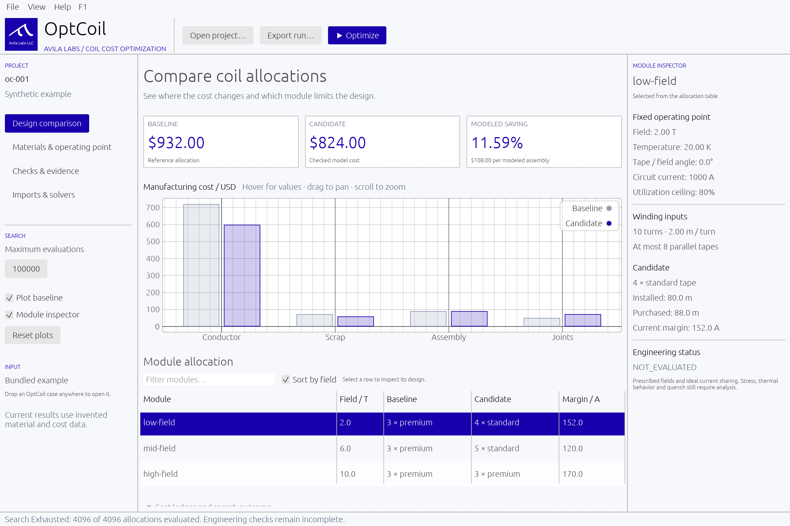

# Converra

**Open-source design and cost optimization for high-temperature superconducting magnets.**

[](https://github.com/AvilaLabs/Converra/actions/workflows/ci.yml)
[](LICENSE)
[](rust-toolchain.toml)

Converra.avilalabs.org

Converra helps magnet engineers and researchers compare coil designs against a fixed specification. It searches winding-pack geometry and REBCO conductor choices, screens candidates against declared requirements, and produces a design record with modeled costs, material provenance, constraint checks, and unresolved engineering limits.

Use the desktop workbench to explore designs, the CLI to run reproducible studies, or the Python bindings to integrate the engine into your own workflow. All calculations run locally through the same Rust engine.

[Download](https://github.com/AvilaLabs/Converra/releases/latest) · [Quick start](#quick-start) · [Documentation](#documentation) · [Contributing](CONTRIBUTING.md)



*Desktop comparison using the bundled synthetic example. Its material properties and prices are invented benchmark inputs.*

## What you can do

- **Search coil designs.** Compare turn counts, tape counts, parallel strands, and permitted geometry choices while holding field, aperture, operating point, and declared constraints fixed. Planar racetrack, circular, and piecewise line-and-arc paths use the built-in field evaluator; non-planar helical paths require a declared field map.
- **Compare conductors and grading.** Evaluate material datasets and product options, or assign different conductor specifications to winding regions. Embedded REBCO data includes measured characterizations and explicitly labeled model fits; you can also load your own datasets.
- **Screen operating limits.** Couple magnetic-field evaluation to critical-current data at sampled tape positions and orientations, with declared utilization, bend, and first-order mechanical limits. Optional screens cover thermal margin, AC loss, and quench bounds. Unsupported material queries produce an explicit unresolved result.
- **Explore tradeoffs.** Run sensitivity sweeps, compare vendor options, and reprice completed studies with documented price provenance.
- **Export design evidence.** Save JSON run records, standalone HTML reports, conductor bills of materials, and procurement summaries with piece and splice schedules when declared by the case.
- **Check the result.** A separate acceptance path recomputes costs and screening checks, including a finer sampling plan where declared. Offline verification checks input hashes and ledger arithmetic; signed dataset bundles support provenance verification.

## Quick start

### Download a release

Prebuilt desktop and CLI binaries are available from [GitHub Releases](https://github.com/AvilaLabs/Converra/releases/latest).

| Platform | Desktop | CLI |
| --- | --- | --- |
| Windows x64 | [ZIP](https://github.com/AvilaLabs/Converra/releases/latest/download/converra-windows-x64.zip) | Included in the same ZIP |
| macOS Apple Silicon | [App ZIP](https://github.com/AvilaLabs/Converra/releases/latest/download/converra-macos-arm64.zip) | [CLI archive](https://github.com/AvilaLabs/Converra/releases/latest/download/converra-macos-arm64-cli.tar.gz) |
| macOS Intel | [App ZIP](https://github.com/AvilaLabs/Converra/releases/latest/download/converra-macos-x64.zip) | [CLI archive](https://github.com/AvilaLabs/Converra/releases/latest/download/converra-macos-x64-cli.tar.gz) |
| Linux x64 | [Archive](https://github.com/AvilaLabs/Converra/releases/latest/download/converra-linux-x64.tar.gz) | Included in the same archive |

Extract the archive and launch `Converra` on Windows/Linux or `Converra.app` on macOS. No Rust installation is needed for these builds. The command-line executable is named `optcoil` (`optcoil.exe` on Windows).

The desktop includes a synthetic example. Open a case JSON or create one with **New search case…**, run a search, and inspect the design comparison, materials, and evidence views. The guided builder authors racetrack cases; general planar and non-planar paths are authored as JSON. Linux desktop use requires a graphical session and graphics drivers.

### Build from source

Install [Rust with rustup](https://rustup.rs/), then clone the repository. The pinned toolchain is Rust **1.95.0**.

```bash
git clone https://github.com/AvilaLabs/Converra.git
cd Converra

# Launch the desktop workbench.
cargo run -p optcoil-app

# Or build the browser workbench (Trunk + wasm):
cd crates/optcoil-app && trunk serve
```

The engine crates retain the `optcoil-*` names. Cargo defaults to the CLI, so headless commands build without the desktop graphics dependencies.

The browser workbench (`trunk serve` in `crates/optcoil-app`) opens and inspects cases and records, authors cases, and downloads every export. Searches, folder-based features (library, bake-off directory, watch mode, run queue) and persistence need the desktop build — the browser is single-threaded, and a search would freeze the tab; the UI says so at each entry point.

### Run a study from the CLI

Run these commands from the repository root:

```bash
# Try the small synthetic allocation example.
cargo run -- demo

# Search a shipped coupled field/conductor case and save its evidence.
cargo run --release -- coupled-search benchmarks/coupled/oc-007.json \
  --output runs/design.json

# Verify artifact bindings and cost arithmetic.
cargo run --release -- verify runs/design.json benchmarks/coupled/oc-007.json

# Export a readable report and a modeled bill of materials.
cargo run --release -- report runs/design.json --output runs/design.html
cargo run --release -- bom runs/design.json --output runs/design.bom.json
```

Coupled searches can take several minutes, depending on the candidate grid and sampling plan. The OC-007 example uses measured conductor data with **synthetic prices**. Run exports protect existing files; choose a new output filename when repeating a study. With a prebuilt CLI, use `optcoil` in place of `cargo run --release --` and supply your case file.

Use `optcoil --help` or `cargo run -- --help` to explore commands for field evaluation, material queries, sensitivity sweeps, dataset comparison, grading reports, and repricing. Keep your own cases and material files in ignored `customer-data/`, and generated records in ignored `runs/`.

### Use the Python bindings

Build the module from source in an activated Python virtual environment:

```bash
python -m pip install maturin
maturin develop --release --manifest-path crates/optcoil-py/Cargo.toml
```

```python
from pathlib import Path
import converra

case_json = Path("benchmarks/coupled/oc-007.json").read_text()
record_json = converra.run_search(case_json)
print(converra.verify_record(record_json, case_json))
Path("report.html").write_text(converra.render_report(record_json))
```

The Python API uses the same case and record JSON schemas as the CLI. See the [Python binding guide](crates/optcoil-py/README.md) for dataset access, sensitivity studies, and comparison workflows. Python wheels are not yet published on PyPI.

## Understanding the results

Converra keeps four outcomes distinct:

| Verdict | Meaning |
| --- | --- |
| `PASS` | The evaluated check passed under its declared model and sampling plan. |
| `FAIL` | The evaluated check violated a declared requirement. |
| `INCONCLUSIVE` | The available data or model could not resolve the check. |
| `NOT_EVALUATED` | The check was not performed. |

**A screening pass does not establish production engineering acceptance.** Read the individual checks and limitations in the record. Offline `verify` checks artifact integrity and arithmetic; it does not validate the underlying physics.

Material data carries its source, operating domain, and data class into each record. Measured data, published model fits, model extensions, and synthetic inputs remain distinguishable. Converra does not silently extrapolate beyond a dataset's supported domain.

Most embedded measured characterizations cover approximately **20–40 K and fields up to 8 T**, with dataset-specific field floors and angular coverage. Higher-field model fits and extensions are explicitly labeled as model-informed. Customer datasets can extend the usable domain; see [loading material data](docs/DATASETS.md) and the [vendor dataset guide](docs/VENDOR_DATASETS.md).

The current models include declared self-field corrections and first-order mechanical, thermal, and quench screens where configured. They do not replace full structural analysis, cooling-system design, quench-protection qualification, or manufacturing validation. External solver field maps can be imported; native COMSOL, Ansys, and Allsolve connectors are planned.

## Benchmarks and validation

The repository includes frozen cases, independent reference tools, and reports documenting results and limitations. Representative studies include:

| Study | Documented result | Scope |
| --- | --- | --- |
| [CERN Feather-M2 comparison](docs/OC010.md) | 184 m of equivalent tape versus an approximate 190 m reference derived from published design data. | Coarse screening comparison; the closest candidate's refined check remained `INCONCLUSIVE`. |
| [Bluemira field cross-check](docs/OC011.md) | Finite-cross-section field agreement of approximately 2–4 × 10⁻⁶ relative across the tested optimum-cell probe sets. | Independent numerical implementation of the same uniform-current physical model. |
| [Coupled cost refinement](docs/OC008.md) | 22.792% lower modeled cost than the original OC-007 baseline. | A bounded design search with synthetic prices and a screening model. |
| [Non-planar helix screening](docs/OC031.md) | No passing design in the declared candidate set; the record identifies current-capacity and data-coverage blockers. | Declared-field-map screening with measured material data. |

These results describe the individual benchmark cases. Dollar savings depend on the declared prices, manufacturing costs, and baseline; conductor comparisons depend on the stated geometry and material assumptions.

## Documentation

| Guide | Use it for |
| --- | --- |
| [First study walkthrough](docs/TUTORIAL.md) | Fifteen minutes: run a search, read verdicts, export evidence. |
| [Technical overview](docs/TECHNICAL_SUMMARY.md) | Design approach, evidence, and model assumptions. |
| [Material and screening domains](docs/SUPPORTED_DOMAINS.md) | Dataset envelopes, self-field regimes, and mechanical screens. |
| [Architecture](docs/ARCHITECTURE.md) | Engine structure, versioned schemas, and acceptance logic. |
| [Material datasets](docs/DATASETS.md) · [Vendor datasets](docs/VENDOR_DATASETS.md) | Custom data, provenance, signed bundles, and registry checks. |
| [Sensitivity studies](docs/SENSITIVITY.md) · [Dataset comparisons](docs/BAKEOFF.md) | Operating-point sweeps and conductor/product comparisons. |
| [Grading reports](docs/GRADING.md) · [Bills of materials](docs/BOM.md) | Regional conductor choices and modeled procurement outputs. |
| [Python bindings](crates/optcoil-py/README.md) · [Packaging](packaging/README.md) | Python integration and desktop/CLI distribution. |
| [Roadmap](ROADMAP.md) · [Changelog](CHANGELOG.md) | Planned work and release history. |

## Contributing

Contributions to measured-data coverage, independent validation, numerical methods, and engineering workflows are welcome. Read [CONTRIBUTING.md](CONTRIBUTING.md) for data provenance, benchmark, and development conventions. Report bugs or propose improvements through [GitHub Issues](https://github.com/AvilaLabs/Converra/issues).

Before submitting changes, run:

```bash
cargo fmt --all --check
cargo clippy --workspace --all-targets -- -D warnings
cargo test --workspace
```

## License

Converra is developed by **Avila Labs** and released under the [MIT license](LICENSE). Third-party dependencies and conductor datasets retain their own licenses; attribution and data terms are documented alongside each dataset in [`data/materials/`](data/materials/).
