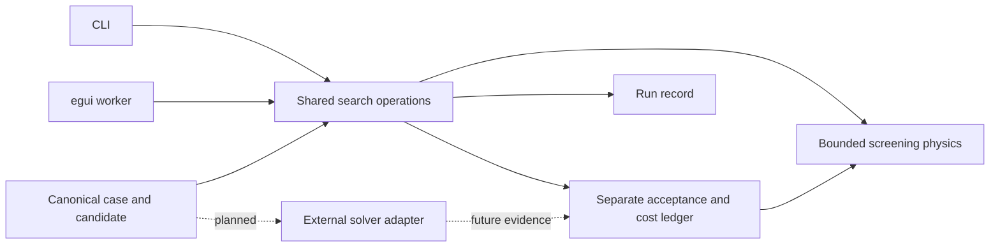

# Architecture

Both interfaces call the same Rust engine. The initial workspace has six crates:

| Crate | Owns |
| --- | --- |
| `optcoil-model` | Allocation schema, versioned magnetostatics schema, materials/domains, manufacturing rules, racetrack geometry and field probes/gates, the `CoilPath` piecewise line+arc planar centerline (coupled-search v9 / coupled-conductor v5), the coupled conductor-geometry screening schema, and the coupled cost-search schema/geometry helper (v2 adds the `refinement`/`baseline` fields OC-008's bisection reads; a v1 case file still parses) |
| `optcoil-physics` | Bounded synthetic current envelope; analytical loop reference; finite-volume racetrack field quadrature with near-face transverse grading, metric-consistent on curved cells (v3); measured-coordinate critical-current interpolation; tape-frame angle-mapping and width-quadrature helpers |
| `optcoil-search` | Bounded enumeration, separate cost checks, headless field/reference comparison, coupled conductor-geometry screening runner, coupled cost search over pack geometry with its own separate acceptance module, `coupled_refine` (per-pancake-count bracketing bisection over that same search's candidate pipeline, reusing its own acceptance module), an `oc007_profile` example measuring per-point kernel-evaluation cost with no search/kernel behavior of its own, run records and exclusive JSON export |
| `optcoil-adapters` | Future external solver request/evidence contract and honest unavailable capabilities |
| `optcoil-cli` | Case/material inspection, allocation/field/material benchmarks, material CSV queries, human/JSON output and validation exit status |
| `optcoil-app` | ACTINV light theme, native opening/drop/export, background tasks, resizable panels, interactive plots, module table/inspector and evidence views |

## Current executable contract

A case contains one fixed series-connected assembly. Each module has a fixed turn count, mean turn length, prescribed field/temperature/angle, allowed grades and tape-count limit. An allocation selects one grade and an integer number of parallel tapes for each whole module. Tapes share current equally. Stock lengths, winding connectivity within a pack and detailed joints are not modeled.

The grade envelope is explicitly synthetic: `Ic(B) = Ic(0) * (1 - field_derating_per_t * B)`. It is a stipulated lower bound, constant over its stated temperature/angle domain. This is not a measured material interpolation. Inputs outside its domain yield no capacity value. Schema v1 accepts only `data_class: synthetic`.

The search enumerates grade/count combinations in deterministic mixed-radix order, starting with the recorded baseline as its incumbent. It checks current capacity and permitted allocation changes, then scores total modeled cost. Search cannot change the current, utilization requirement, field inputs, material data or manufacturing rules.

Acceptance independently reconstructs installed/purchased tape lengths and the cost ledger from the candidate. It checks interfaces and reruns the shared current-capacity model. This separates search scoring from cost accounting, but does not supply independent physical evidence. Search and checker cost must agree within `1e-8 * max(1, checked_total_usd)`; capacity has no hidden feasibility tolerance.

The search space uses checked `u64` arithmetic. Schema limits are 32 modules, 32 grades and 64 tapes per module. Oversized enumeration spaces are rejected; an evaluation budget limits actual work. A budget/cancellation result retains the best screening-passing candidate found, possibly the baseline. Only exhaustion with zero unresolved candidates sets `proven_optimal_in_screening_model`. Missing material coverage prevents that claim.

## Evidence and statuses

`screening_status` describes modeled capacity and module-interface rules only. A failed modeled constraint yields `engineering_status: FAIL`; all other candidates remain `NOT_EVALUATED` for overall engineering acceptance in this build. Coupled magnetic fields, mechanics, thermal behavior, quench and actual manufacturing each have explicit unevaluated checks.

Run records embed the case, settings, candidates, quantity ledgers, constraint results, timings, counts and model identities. SHA-256 identifies normalized serialized inputs. Time fields are not reproducible; numerical decisions and input identity are deterministic for the same build and inputs. Manual implementation identities must change with model semantics. There is no cache, source-code attestation or solver evidence yet.

## External solver boundary

### Implemented internal field benchmark

`optcoil-model::magnetics` defines `optcoil-magnetostatics/v1`, separate from allocation schema v1. `optcoil-physics::racetrack::RacetrackEvaluator` integrates prescribed current through a rectangular winding pack. `optcoil-search::field` evaluates three resolutions, validates independently generated reference identities and compares field vectors under frozen case limits. CLI commands `field-benchmark` and `field` expose these operations. The app remains an OC-001 client for now.

The comparison uses an independently implemented analytical-axial/planar quadrature reference, not an external FEM solver. Field reports contain exact case/reference byte hashes, implementation-source identity, counts, hardware and reference provenance; their engineering status is always `NOT_EVALUATED`. This additional source fingerprint applies to field reports; the earlier allocation-run identity remains unchanged. See [OC-002](OC002.md) for methods, bounds and reproducibility.

### Implemented material characterization

The measured-material path is also separate from allocation schema v1. `optcoil-model::material` imports a CSV/metadata pair with provenance, units, conventions and a content hash. `optcoil-physics::critical_current` constructs bounded measured-coordinate tetrahedra. `optcoil-search::material` owns queries, withheld-plane validation and the linear/development/reserved comparison suite. A domain pass is not an engineering-current allowance. Missing coverage or an unsupported electric-field criterion produces no estimate. See [OC-003](OC003.md).

### Implemented coupled screening

The coupled path lives beside, not inside, allocation schema v1 or the two schemas above. `optcoil-model::coupled` defines `optcoil-coupled-conductor/v1`: a fixed racetrack pack and winding, an operating point, the material-mapping/angle/mirror/low-field policy settings, a station/turn/tape/width sampling plan and the numerics gates. `optcoil-physics::tape_frame` decomposes the field into normal/wide-face/tangential components, folds and mirrors the angle, applies the low-field clamp sequence, and audits monotonicity. `optcoil-search::coupled` builds the `IcInterpolator` and both `RacetrackEvaluator`s once, evaluates every station/turn/tape/width point at unit ampere-turns per order, scales linearly per current candidate, applies the fail-closed status lattice (point → tape → candidate), and validates an independently generated Python reference before comparing against it. CLI commands `coupled-benchmark` and `coupled` expose these operations; the app remains an OC-001 client. `conductor_qualification_status` is always `INCONCLUSIVE` and `engineering_status` is always `NOT_EVALUATED` in this build — a PASS candidate is a screening current allowance under declared assumptions, never a qualified operating limit. See [OC-004](OC004.md) for the assumptions, evidence numbers and observed results, including the near-face quadrature revision this benchmark's own diagnosis drove back into `optcoil-physics::racetrack` (now shared with OC-002).

### Implemented coupled cost search

`optcoil-model::coupled_search` defines `optcoil-coupled-search/v1`, a schema separate from the coupled screening case above: a fixed field requirement, discrete `(turns_along_normal, tapes_along_width)` choice sets, sampling/limits reused verbatim from `coupled::Sampling`/`coupled::Limits` where the contract calls for identical rules, a conservative coarse-plan pruning declaration (pruning only when every coarse point's own refinement is itself converged), a declared acceptance-only refined sampling plan (`refined_plan`: additional stations plus a maximum sampling shortfall fraction) and a synthetic cost model. Its `build_coupled_case` is a pure geometry helper that expands one `(turns, tapes, current_a)` candidate into a real `coupled::CoupledCase` — the same schema OC-004 uses — so every geometry the search scores is evaluated by the identical, already-proved-out coupled runner rather than a reimplementation. `optcoil-search::coupled_search` runs the exhaustive search (`std::thread::scope` over a declared thread count, results collected deterministically by candidate index), reusing `coupled::evaluate_candidate_point` and `coupled::aggregate_status` (`pub(crate)`) for its own coarse pre-screen and the unmodified `coupled::run_coupled_case` entry point for the full plan. `optcoil-search::search_acceptance` is a separate module, separate authority: it independently recomputes the cost ledger and the bore field (compared at the candidate's own ampere-turns, in tesla) for the selected optimum and the baseline, re-runs the coupled screening through a freshly generated case with no reference (so its own `independent_comparison` is `INCONCLUSIVE` by construction; `refinement_status` is the check it relies on instead), and — for any candidate that was itself PASS — re-evaluates the screening on the declared finer `refined_plan` (its own thread pool partitioned across stations), reporting both the coarse and refined minima/limiting points and the shortfall; a shortfall beyond the declared gate, or the refined plan losing PASS outright, downgrades `search_status` to `INCONCLUSIVE` rather than `PASS`. CLI commands `coupled-search` and `coupled-search-benchmark` expose this; the app remains an OC-001 client. See [OC-007](OC007.md) for the frozen cases, their hashes and results: the primary case (OC-006's low-field dataset) reports a 120x4 optimum at $41,513.13 versus a $50,541.41 baseline, $9,028.28/17.863% modeled savings, `search_status: PASS`; the pre-declared original-dataset control reproduces the same candidate table and optimum at the search level but comes back acceptance-level `INCONCLUSIVE` on the refined plan (2 of 6,400 points, a diagnosed low-field angular-coverage gap the low-field dataset does not share).

### Implemented coupled cost refinement

`optcoil-model::coupled_search` schema v2 extends v1 (unversioned as its own schema id; a v1 case still parses) with a `refinement` block (`pancake_counts`, `turn_resolution`, `turn_bounds`, per-pancake-count `brackets`, `monotonicity_check`) and a `baseline` candidate (in OC-008's own frozen case, OC-007's own selected optimum, 120x4). `optcoil-search::coupled_refine` runs, independently per declared pancake count and in parallel across the case's thread pool (never more than `max_threads` candidates evaluated at once), an integer bisection on turn count: it verifies the declared bracket (`fail_turns` FAILs or is INCONCLUSIVE, `pass_turns` PASSes) before bisecting at all, records `bracket_status: INVALID` and evaluates nothing further for a pancake count whose bracket does not hold, bisects to the declared `turn_resolution`, and checks that utilization is nonincreasing in turn count across every evaluated point for that pancake count (a violation sets that pancake count's own result `INCONCLUSIVE`, never silently patched). Every candidate evaluation reuses `coupled_search::evaluate_one_candidate` — OC-007's own requirement→NI→I_op→coarse-pruning→full-plan pipeline — unchanged, so no screening physics is reimplemented. The global optimum is the cheapest valid, monotone pancake count's smallest passing turn count; `search_acceptance` (also unchanged from OC-007) independently reruns it and the declared baseline. CLI commands `coupled-refine` and `coupled-refine-benchmark` expose this; the app remains an OC-001 client. A separate, measurement-only example (`crates/optcoil-search/examples/oc007_profile.rs`, `cargo run --release --offline -p optcoil-search --example oc007_profile`) re-evaluates OC-007's own optimum's sampling grid directly through `RacetrackEvaluator` to report kernel evaluations per point by station and by turn index (near-face vs. interior) — a profiling measurement with no search or kernel behavior of its own, not a new code path search results depend on. See [OC-008](OC008.md) for the frozen case, its hash, the evaluated-candidate tables and the global optimum: 72x6 at $39,021.82, $2,491.31/6.001% cheaper than the 120x4 baseline and $11,519.60/22.792% cheaper than the original 200x3 baseline, `search_status: PASS` — sitting at the top of its own declared pancake range and within 0.0235 utilization of the 0.8 limit, a design with no margin beyond the declared limits and not shown to be a global optimum over pancake count.
`optcoil-model::coupled_search` schema v9 (with `optcoil-model::coupled` schema v5) generalizes the fixed geometry from a racetrack to any closed piecewise line+arc planar `CoilPath` declared under `fixed_geometry.path` (`pack.path` on the generated conductor case): D-shapes and picture-frame coils, not only racetracks. The two geometry declarations are exclusive — exactly one of (`straight_half_length_m`, `bend_radius_m`) or `path` must be present, and `Station::Path { s_m }` locates sampling stations by arc length along the centerline where legacy `Straight`/`Arc` kinds are rejected (and vice versa). On a path pack the tape offset `rho` is a signed normal offset from the centerline (inner face at -w/2), bend screening uses the path's minimum local curvature radius minus half the pack width, the hoop bound takes the maximum arc radius, good-field overlap walks the centerline distance, and the cost ledger meters each turn along its offset curve rather than 4L + 2*pi*rho — which `length_at_offset_m` reproduces exactly on `CoilPath::racetrack`. `build_coupled_case` emits a v5 conductor case for path geometry (v1–v4 as declared for legacy), so the OC-004 runner and the acceptance module evaluate the identical path; `search_acceptance` recomputes the ledger independently from the segment list. Racetrack cases v1–v8 keep their schema, semantics and generated-case versions unchanged. See the OC-019 fixture (`benchmarks/coupled/oc-019.json`, embedded as `CoupledSearchCase::embedded_oc019`).

`optcoil-model::coupled_search` schema v10 (with `optcoil-model::coupled` schema v6) adds graded packs — different conductor specs on different radial turn ranges. The case declares `tape_specs` (a named `MaterialSettings` binding plus its own `price_usd_per_m`) and `grading.regions`, each mapping a `turn_range` fraction of `turns_along_normal` (resolved to inclusive turns `floor(lo*N) < k <= floor(hi*N)` from the inner face outward) to a list of candidate spec ids — the reserved id `"base"` selects the case-level `material` at `cost.price_usd_per_m`. The candidate grid gains the per-region choice product, the baseline carries its own `tape_spec_ids`, and `build_coupled_case` resolves the assignment into explicit `winding.regions` (`first_turn`/`last_turn`/`tape_spec`, non-base only) plus a `tape_specs` map containing only the referenced bindings — emitting conductor schema v6 whenever any region is emitted. The runner resolves every binding to its own dataset (supplied datasets must be declared by a binding; a missing binding dataset is an error, never a substitute) and builds a per-binding runtime (interpolator, monotonicity audit, critical-state table); each sampled point screens under the runtime its turn index resolves to. The cost ledger prices each turn at its assigned spec — scrap included — while ungraded cases keep the legacy `length × price` ordering bit-identically. Acceptance recomputes the graded ledger and reruns the generated v6 case against the full dataset map. A region that collapses empty on a candidate's turn count is a per-candidate FAIL, not a run abort. Search schema v12 adds the optional `mechanical.max_transverse_pressure_pa` bound: each sampled turn's signed normal Lorentz load per unit length `I_op·⟨B·ŵ⟩` (the width-direction field component drives the tape-normal force) is trapezoid-accumulated along the turn-stacking direction, and the peak interface pressure — the largest cumulative load an interface could transmit under either face-anchored support convention, divided by the tape-width interface extent — must stay within the declared bound, failing closed when the bound is declared but no pressure was sampled. The estimate is recorded on every screened candidate (`transverse_pressure_pa` plus its station/column/interface location), bounded only when declared; the acceptance module recomputes it from its own rerun's station data with a separately written accumulation and folds it into `mechanical_agreement_status`. Run-schema v12 also makes the estimate's *resolution* auditable: the refined §9.4 plan accumulates its own pressure (`refined.transverse_pressure_pa`), and when a bound is declared the `pressure_coverage` check requires that denser sampling reproduce the declared plan's estimate within the same `max_sampling_shortfall_fraction` gate — an under-resolved load profile fails agreement rather than passing silently. It is a first-order declared-bound screen, not a structural or strain model — and its value depends on the declared sampling plan's turn coverage, now with that coverage itself checked. See the OC-021 fixture (`benchmarks/coupled/oc-021.json`, embedded as `CoupledSearchCase::embedded_oc021`), where the declared 30 MPa bound eliminates the cheapest screening-passing candidate. Search schema v11 adds assignment-aware refinement: a graded case bisects each (`tapes_along_width`, assignment) slice over that tapes' shared declared bracket — an assignment whose endpoints cannot meet the bracket's own expectation is INVALID for that slice only — and the global optimum is selected across all valid slices; because region boundaries are `floor()`-computed from `n`, graded refinement requires `monotonicity_check: true`. Graded cases at schema v10 still may not declare `refinement`. See the OC-020 fixture (`benchmarks/coupled/oc-020.json`, embedded as `CoupledSearchCase::embedded_oc020`). The run record schema v13 surfaces the resolved dataset provenance directly on the search record — `monotonicity_audit` for the base binding plus per-spec `spec_datasets`/`spec_monotonicity_audits` maps (identity, csv_sha256, point count, mesh summary and each binding's audit under its own declared tolerance) — so a graded record shows the dataset actually loaded per binding, not only the case's declared pins. See the OC-022 fixture (`benchmarks/coupled/oc-022.json`, `embedded_oc022`): the first graded benchmark over two physically distinct measured datasets (SuperPower AP + Shanghai SC HFLT).

`optcoil-model::coupled_search` schema v13 lifts the declared field map to the search level: the case declares `field_map` (the coupled-v7 `cylindrical_br_bz` map plus the producer's `bore_field_at_reference_t` anchor) together with `fixed_geometry.pack_radial_width_m`/`pack_axial_height_m` — the physical pack footprint the customer's map was computed on. Under a map the extents are the fixed declarations and the choice counts set the pack's discretization, not its footprint (`candidate_extents_m`); the still-required `radial_pitch_m`/`tape_width_m` describe the *baseline* winding, and validation requires `baseline counts × pitch/width` to reconstruct the declared extents along the normal and width directions respectively (`tape_normal` selects which extent each direction fills). NI solves from the declared anchor by magnetostatic linearity — `bore_field_at_reference_t / reference_ampere_turns_a` — so the requirement screen and every sampled point spend zero field-kernel evaluations; `requirement.good_field_region` is rejected because the map covers the pack only. Every quantity derived from the pack footprint honors the fixed extents and the tape normal's direction mapping: the cost ledger places a turn row's conductors at their signed radial offsets — the turn index advances along the *normal* direction, so under an axial normal every turn is the same hoop while its `tapes` conductors spread across the radial extent (symmetric offsets summing to the nominal perimeter), and under a radial normal the turns span the declared radial extent — the hoop bound's outer radius takes the declared radial extent, and the transverse-pressure interface width takes the candidate's own `candidate_tape_width_m`. `search_acceptance` recomputes the same ledger per-conductor (per-tape radial offsets under an axial normal) and the same extents for its independent agreement checks; `build_coupled_case` emits coupled-v7 cases carrying `sampling.field_map`, and the run record (v14) carries the map's provenance. Field maps are produced outside this repository (FEA exports or solver-owning pilots) and carried with their own provenance.

`optcoil-model::coupled` schema v8 generalizes `sampling.field_map` components from the single `cylindrical_br_bz` string to an internally-tagged enum and adds `cartesian_bx_by_bz`: a rectilinear `(x, y, z)` grid of lab-frame `(bx, by, bz)` values at `reference_ampere_turns_a`, for non-axisymmetric windings and solver exports that do not produce cylindrical components. Cylindrical cases are wire-identical to v7. Confinement for a Cartesian map is checked against the exact swept domain of the declared path — segment entry/exit poses plus the arc points where the path tangent is axis-parallel — rather than a cylindrical hull. Search schema v14 admits the same component through its own `field_map` declaration, synthesizing the required path from the fixed racetrack geometry when the case is racetrack-based. Consumption is basis-agnostic: the runner converts the nearest node's components to the lab frame and runs the identical tape-frame/screening/status lattice, and `field_model_id` names the component basis used.

`optcoil-model::coupled_search` schema v15 adds four optional declared adjacent screens — `thermal_margin`, `ac_loss`, `quench_hotspot` and `screening_current` — evaluated per candidate from the full plan's per-point record (each point's recorded lab field crossed into its tape frame gives the face-normal `b_n`, in-plane `b_w` and along-current `b_t` components). `thermal_margin` root-finds each point's critical-state temperature against that point's own interpolated sheet capacity at the carried per-width demand (`I_op / (strands × tape_width)`) and reports the worst `T_cs − T_op`; a demand resolvable only below the dataset's temperature span reports a lower bound, and unresolvable points are INCONCLUSIVE — never extrapolated. `ac_loss` integrates a first-order hysteretic estimate per cycle — Norris thin-strip transport loss at the declared amplitude fraction, a Bean slab term for the in-plane component across the declared superconducting-layer thickness, and a rigorous upper bound `K_c·w²·|b_n|` for the face-normal component — weighted by the same per-position lengths as the cost ledger and scaled by the declared frequency; it is an estimate plus a bound, not an AC-loss simulation. `quench_hotspot` adds `J²τ/2` to a customer-declared quench-integral table `U(T) = ∫C_p/ρ_e dT` under a declared exponential dump and inverts it piecewise-linearly; table exhaustion is INCONCLUSIVE, and the screen models no normal-zone propagation. `screening_current` applies the Brandt–Indenbom strip relation — flux-free core `a/cosh(b_n/B_c)`, `B_c = μ₀K_c/π` — and flags candidates whose penetrated-width fraction exceeds the declared allowance, meaning screening currents are of order the transport sheet current and uniform-transport capacity figures are unreliable there. Each declared screen's status joins the candidate's aggregate (any FAIL fails; INCONCLUSIVE or NOT_EVALUATED keeps the aggregate inconclusive), pruned or requirement-failed candidates carry NOT_EVALUATED records, and `search_acceptance` independently recomputes all four — separately written iteration, root-find and accumulation — comparing status and headline values at ~1e-6 relative tolerance under the `adjacent_screens` check. These screens do not establish quench protection, cryogenic adequacy, screening-stress safety, manufacturing readiness or engineering acceptance.

Search schema v18 adds a sixth optional screen, `quench_transient`: a lumped adiabatic driven-dump trajectory — the point-resolved generalization of `quench_hotspot`'s MIIT bound. Each sampled point's superconductor carries `I_sc = K_used(B,θ,T)·w`, re-queried at the evolving lumped temperature under the same mirror-pair + low-field-clamp policy the capacity screen used; the remainder `I_m = max(0, I_strand(t) − I_sc)` flows in the declared composite (`conducting_area_per_width_m × tape_width_m` per strand) and heats it `dT/dt = J_m²·ρ_e(T)/C_v(T)` under an exponential dump `I(t) = I_op·e^(−t/τ)`. The declared `initial_temperature_k` (≥ T_op, inside both property tables) is the "quench detected, protection fires" boundary condition — without it the dump alone decides, so only over-critical points share. The declared ρ_e(T) and C_v(T) tables and the dataset's own temperature span are hard limits: a trajectory that exits either stops with its last in-coverage temperature flagged a lower bound, and the screen reports INCONCLUSIVE — never extrapolated. A point whose matrix share returns to zero has recovered permanently (the dump is monotone) and stops integrating; a point that never shares contributes T₀ and zero signature. The record carries the winding peak temperature with its limiting point, the first detection-time crossing of the declared `detection_voltage_v` on the per-strand series signature `Σ J_m·ρ_e·w_q·dℓ`, the peak signature, and the point counts; `max_temperature_k` and `max_detection_time_s` bound it fail-closed, a declared quench that produces no signature fails detectability by construction, and pruned candidates record NOT_EVALUATED. The integration scheme — forward Euler, 8192 fixed steps over 10τ — is part of the model identity; `search_acceptance` (checker v11) re-integrates each sharing point's trajectory on its own seeds and fails agreement on status, peak temperature, detection time, peak voltage, or coverage-flag mismatch. This is a first-order lumped bound over declared properties and measured capacity — not a normal-zone-propagation, protection-circuit, or coupled thermal-EM quench simulation: initiation physics, cooling, insulation, turn-to-turn coupling, and the dump's own field decay are all unmodeled.

Search schema v17 adds the first-order winding-mechanics pair: `manufacturing.tape_thickness_m` / `manufacturing.max_bend_strain` and `mechanical.max_membrane_tension_n_per_m`. The manufacturing block's inner bend radius — the minimum local path curvature minus half the pack radial extent, already the `min_inner_bend_radius_m` gate's input — is now recorded per candidate, and a declared tape thickness produces the outer-fiber bend strain `t/(2·R_inner)`, the elastic-beam estimate of the bent stack's peak surface strain (neutral-axis offset, anisotropy and residual wound strain unmodeled); a declared strain bound folds into `manufacturing_feasible` fail-closed, while thickness alone records the strain unbounded. The transverse-pressure accumulation already computes the peak cumulative signed normal Lorentz load any turn-boundary interface could transmit under either face-anchored support convention; v17 records that resultant before the interface-width division as `membrane_tension_n_per_m` — the first-order diametral bursting tension a hoop-wound pack's structure must carry — and a declared bound folds into `mechanical_feasible` fail-closed. The run record schema is v17; `search_acceptance` (checker v10) recomputes the strain from its own inner-radius arithmetic and the tension from its own load-column accumulation, and the verdict-level agreements fail on any mismatch. Both are declared-assumption first-order bounds — not winding-mechanics FEA, contact modeling, insulation compliance, or support-structure analysis.

Search schema v19 / coupled-conductor schema v9 open a scoped non-planar path: `fixed_geometry.path3d` / `pack.path3d` declare a `CoilPath3D` centerline built from helix segments — each declared absolutely by its axis (origin, direction, resolved to a canonical orthonormal basis), cylinder radius, start azimuth, signed turns and signed rise per turn — joined position- and tangent-continuously, open by default (a helical layer's ends are its leads) with `closed` available for loops that return to their start pose. The tape frame generalizes planar semantics exactly: `t̂` is the path tangent, `n_ref` the outward cylinder-radial direction (for a helix, exactly the Frenet normal), and the in-surface binormal `ŵ = n_ref × t̂` completes the frame the way `ẑ` completes a planar path's — the CORC/CCT convention where the tape's broad face tracks the winding's cylinder-radial direction. A `Centerline` abstraction lets stations, field-map confinement, good-field overlap and the cost ledger consume either path family through one interface; offset turns on a helix are helices of radius `R + δ` and unchanged rise, giving per-segment installed length `|turns|·2π·hypot(R+δ, rise/2π)`, and bend bounds apply the helix's effective curvature radius `λ²/R` rather than the cylinder radius itself. The slice is deliberately bounded: path3d requires the radial tape normal (the only stacking a helix models), a declared field map, and `cartesian_bx_by_bz` components — the engine's pack self-field evaluator is planar and is never run on a non-planar pack; cylindrical maps accept only axisymmetric planar circles; and good-field-region evaluation stays engine-side, so path3d cases cannot declare it. Map confinement checks the swept band's exact axis-extremum corner curves (the cardinal-angle machinery lifted to the rotating r̂/φ̂ basis). Run record schema is v19 and the search checker v16; `search_acceptance` (checker v12) recomputes helix installed lengths from its own per-segment `|turns|·2π·hypot(R+δ, c)` arithmetic rather than the production helper. What this does not claim: no helical-pack self-field, no 3D good-field-volume requirement, no non-planar screening-current model — a helix case is a declared-map screening of a genuine non-planar geometry, not engineering acceptance of one.

Search schema v16 adds a fifth optional screen, `transition`: a measured E–J transition screen bound to the datasets' own per-point `n_value` channel. `IcEstimate` now carries the exponent — an exact measurement returns its node's `n_value`, an interpolated estimate blends `n_value` linearly on the same tetrahedron weights as `ic_a_per_m` (a linear channel under both interpolation methods; only B and Ic transform), and nonfinite or sub-1 results are rejected rather than carried. `AngleQuery`/`ClampedPoint` propagate the exponent from whichever mirror-pair or clamp branch supplied the governing `k_used_a_per_m`. Per evaluated point the screen computes the operating ratio `u = k_demand/k_used` and the transition depth `E/Ec = u^n` with the operating block's declared `electric_field_criterion_v_per_m`; it reports the worst `E/Ec` with its `u` and `n`, the limiting point, and a per-strand terminal-voltage estimate `Σ Ec·(E/Ec)·w_q·dℓ` normalized over stations — the voltage a tap across the winding would see. PASS requires the worst depth within `max_e_over_ec` and the terminal voltage within `max_voltage_v` when declared; any point whose capacity or measured exponent cannot resolve makes the screen INCONCLUSIVE — never extrapolated, never a silent PASS. The run record schema is v16; `search_acceptance` recomputes the screen on its own rerun — re-querying the mirror pair for the governing branch's exponent — and fails agreement on any status, depth or voltage mismatch. This is a first-order power-law screen on measured data, not a current-sharing or transient quench simulation.

`optcoil-model::coupled` schema v7 adds `sampling.field_map` — a customer-declared external field map that replaces the engine's field solve at every sampled point. The declared form is a rectilinear axisymmetric grid (`components = "cylindrical_br_bz"`): strictly-ascending `rho_levels_m`/`z_levels_m` plus a complete, sorted `(rho_index, z_index) -> (br_t, bz_t)` entry table in tesla at `reference_ampere_turns_a`, hash-bound by `source_sha256`. Validation requires an origin-centred +360-deg circular `pack.path` (the path normal is the outward radial direction the cylindrical components assume) and confines the pack's sampled domain inside the half-spacing-extended nearest-node hull — out-of-hull queries fail closed; there is no extrapolation. Under a map the runner builds no evaluators (`kernel_evaluations` = 0), looks up the nearest declared node per width point and converts `(B_r, B_z)` to the lab frame at that point's azimuth, then runs the identical tape-frame/screening/status lattice; per-point `refinement_change` is 0 by construction since the map's own mesh is the resolution. The run record (v8) carries the map's provenance and sets `field_model_id = customer-declared-field-map/cylindrical-br-bz/v1` — a declared map is never labelled as an engine field solve. This is the interface for evaluating a customer's own field solution (e.g. their FEA export) without their geometry or solver leaving their environment.

`optcoil-model::bakeoff` defines `optcoil-bakeoff/v1` — the vendor bake-off spec: a provenance string plus 1–16 declared datasets, each resolving from the embedded registry by `dataset_id` or from a named `optcoil-material-dataset` bundle path. `optcoil-search::bakeoff` runs the case once per dataset, mutating only `material.dataset_id`/`csv_sha256` — every other declared policy stays identical, so rows compare like-for-like — through the ordinary `run_coupled_search_case_with_dataset` entry point, so each row's acceptance recomputation stands on its own. The `optcoil-bakeoff-record/v1` record stores each entry's mutated case verbatim plus `case_sha256` and the resolved `dataset_csv_sha256` (every row independently re-runnable), the headline verdict/cost/savings/`max_utilization` (the margin the price buys), and a mechanical ranking — PASS rows by modeled savings descending, then INCONCLUSIVE, then FAIL — with unresolvable or invalid datasets recorded as `error` rows, unranked but kept as data. The ranking is never a vendor endorsement: a FAIL row means no candidate passed this case's declared screening under that dataset. CLI command `bakeoff` exposes this. See [BAKEOFF](BAKEOFF.md) for the spec format and reading guidance.

`optcoil-bakeoff/v2` turns the comparison into a procurement one: entries are `products`, not datasets. Each product declares a `product_id`, the dataset binding, and the attributes a purchasing decision needs — the product's real `tape_width_m` (mutating `fixed_geometry.tape_width_m`: a 4 mm product is a different winding topology, not a label — the OC-022 lesson), optional `tape_thickness_m` for the v17 bend bound, a required `price_usd_per_m` with a required `price_source` provenance class, an optional `piece_offerings` catalogue applied to `cost.piece_offerings` under the case's declared piece policy, and optional `material_policy` overrides (every policy field except the dataset-bound `method`). The mutated case re-validates before running — a catalogue without a piece policy, a width that breaks field-map extent consistency, or a thickness without a manufacturing block records an `error` row with the real reason. v2 refuses graded cases outright (a single product price cannot honestly reprice per-spec selections) and requires the base case at schema v24 (the provenance fields it mutates are v24-gated). Ranking shifts to the procurement figure: PASS rows by accepted `optimum_total_usd` ascending — the cheapest substantiated design wins — then INCONCLUSIVE, then FAIL; `ranking` names `product_id`s and `ranking_basis` states the rule. The record is `optcoil-bakeoff-record/v2` (`product_id` on each row, serde-defaulted so v1 records still parse). Honest limits stay in `limitations`: rows are different physical cases answering the same requirement, comparable through the declared baseline topology; `quoted` means a declared quote, not a live feed; a dataset's support for the product's declared width remains the dataset's own provenance question.

`optcoil-search::gradereport` builds the grading comparison report (`optcoil-grading-report/v1`) — a derived view over a completed coupled-search run record, never a recompute: per spec id, the cheapest PASS candidate whose per-region `tape_spec_ids` assignment is uniformly that spec ("one vendor everywhere"), next to the search's own optimum. `grading_delta_usd` is best-uniform minus optimum cost — nonnegative by construction, since the graded grid strictly contains the uniform assignments — and `optimum_is_uniform` records when the mix bought nothing. The report binds `source_record_sha256` (the record file's bytes) so every figure traces to candidates the record's own acceptance checked; a record with no graded candidates is rejected — there is nothing to compare. CLI command `gradereport` exposes this. See [GRADING](GRADING.md).

`optcoil-search::bom` builds the bill of materials (`optcoil-bom/v1`) a completed coupled search's optimum implies: per-turn ledger rows (`turn_ledger_rows` — the same walk `compute_cost_ledger` sums) grouped per spec into contiguous `turn_ranges`, installed metres × (1 + scrap_fraction) purchased metres, per-spec conductor and scrap dollars at each spec's own price, plus the ledger's own joint (`tapes − 1`) and pancake (`tapes`) counts. `totals_agree` reconciles the derived totals against the record's own ledger at 1e-9 relative — a disagreement is a defect, not a view difference — and a record with no PASS optimum is rejected: there is nothing to buy. A modeled procurement document, not a purchase order. CLI command `bom` exposes this. See [BOM](BOM.md).

Search schema v20 adds the optional `opex` block — declared refrigeration economics for the operating point, so "colder = less tape but more cryo" is a declared lifecycle-cost axis rather than a fixed assumption. The cold-side load is the declared sum of named `heat_loads_w` terms (the case author's own estimate — static, conduction, declared AC loss, leads); the electrical input is Carnot-scaled at a declared efficiency fraction, `input_w = load × (T_sink − T_op) / (T_op × cop_fraction_of_carnot)` — the T-dependence is thermodynamics, not a claim about a specific plant. Lifetime opex is undiscounted: `input_kW × hours_per_year × $/kWh × operating_years`. The ledger gains `opex_usd` and `lifecycle_usd` as `Option` fields — absent when no `opex` is declared, never a defaulted zero. The terms are case-constant (no candidate-dependent loads are modeled), so within-case rankings and savings are unchanged — the capex-vs-opex trade materializes across the `temperature_k` sensitivity axis, which now prices the operating point it sweeps. Run record schema is v20, the search checker v17; `search_acceptance` (checker v13) re-derives the Carnot-scaled input power on its own arithmetic and fails cost agreement on a planted `opex_usd` disagreement.

Search schema v21 makes the legacy racetrack dimensions searchable: `choices.bend_radius_m` and `choices.straight_half_length_m` declare independent discrete axes that multiply into the candidate grid alongside turns, tapes, strands and grading assignments — magnet size as a tape-cost lever inside the enumeration rather than a manual re-run per shape. An axis requires its `fixed_geometry` field absent (one declaration site per dimension, enforced by a paired-booleans gate), a `baseline` value drawn from its own list, and a racetrack family — a declared `path`, `path3d` or `field_map` fixes the winding shape the map or path was computed on, so the axes are forbidden there, and declaring one axis leaves the sibling dimension to resolve through either its own axis or its fixed field. Evaluation resolves each candidate's dims through `FixedGeometry::resolved_for` — one shadowed `FixedGeometry` feeding extents, the Racetrack evaluator, pack-overlap and good-field checks, bend/mechanics bounds, per-turn loop lengths and the cost ledger — and `build_coupled_case` writes the searched dims into the generated conductor case's `Pack`, so the OC-004 runner and the refined plan evaluate the candidate's own shape. The candidate record (run schema v21) carries each candidate's resolved `bend_radius_m`/`straight_half_length_m` — absent on fixed-geometry cases, where the case itself is the declaration. `search_acceptance` (checker v14) re-resolves dims from the record for every recomputation — a record naming one geometry but priced or screened at another fails by construction. The OC-008 bracketing-refinement runner rejects geometry-axis cases at entry: a declared turn bracket assumes turn-monotonicity at a single fixed geometry, and searching the axis would silently compare different magnets. Station validation treats an axis-declared dim as the racetrack family — the placeholder pack takes the first declared value, the family gate being all stations need.

Search schema v22 adds `requirement.good_field_region.max_relative_deviation` — a declared uniformity bound over the usable-volume lattice, the field-quality check a real MRI/accelerator spec writes down. The region evaluation already visits every lattice point at both quadrature orders for the weakest-point requirement; v22 additionally records the fine-order maximum and the scale-free deviation `(Bmax − Bmin)/B_center` (unit fields, so the figure is geometry-pure and NI-independent; a non-positive center value yields INFINITY, which fails any declared bound honestly). The bound joins the requirement gate alongside pack-clearance and the region refinement check: a coil may satisfy the target at the weakest point and still fail the declared homogeneity. The run record (v22) carries the maximum and deviation on every candidate, bounded or not — the figure is auditable data even when no spec is declared. `search_acceptance` (checker v15) recomputes both lattice extremes on its own evaluation and re-derives the deviation on its own center value, compared under the same NI-scaled absolute gate as the region minimum — a record claiming a uniformity different from what it evaluated fails region agreement by construction. Deliberately bounded: this is a peak-to-peak homogeneity screen over the declared box lattice, not a harmonic or multipole decomposition (a cylindrical field expansion is a different, deeper measurement), and the bound lives inside the region declaration, so declared-map cases — where the good-field region itself is forbidden — cannot declare it.

Search schema v23 adds `requirement.good_field_region.harmonics` — the multipole form accelerator field-quality specs are actually written in. A declared `reference_radius_m` draws a circle in the region midplane (z = probe z, the x–y plane through the region center); `theta_samples` equally spaced `B_z` evaluations at the fine quadrature order feed a direct DFT into normal `b_n` and skew `a_n` coefficients for `n = 1..=max_order`, recorded in units of the circle's own mean field `b_0` — the accelerator "units of 1e-4" convention (divide the fraction by 1e4). Validation enforces the circle strictly inside the region's in-plane extents, `max_order` within 1..=16, and Nyquist (`theta_samples ≥ 2·max_order + 1`): declared orders resolve exactly, higher content aliases by declared construction rather than hiding. Optional `max_normal_unit_fraction`/`max_skew_unit_fraction` bounds join the requirement gate alongside the v22 deviation bound; an undeclared-bound expansion still records the full spectrum — the coefficients are auditable data even when no spec gates them. The run record (v23) carries `harmonic_b0_t_per_ampere_turn` and both coefficient vectors as `Option` fields — records predating v23 parse and verify under their own semantics. `search_acceptance` (checker v16) re-evaluates the circle on its own evaluator and re-derives every coefficient, compared coefficient-wise under the NI-scaled gate (de-normalized through the recorded b0 into tesla): a record claiming a spectrum it did not evaluate — or a length-mismatched or missing spectrum against a declared expansion — fails region agreement by construction. Deliberately bounded: a single midplane circle of the axial component, not a full 3D harmonic survey — off-midplane planes and transverse-component expansions remain open, and declared-map cases still cannot declare the region at all.

Search schema v24 adds piece-length procurement: `cost.piece_policy` (a `boundary` — `per_module` or `continuous` — a `piece_unit` — `conductor_unit` or `per_strand` — a `splice_cost_usd`, and an optional single `piece_length_m`) plus `cost.piece_offerings` and per-spec `tape_specs[*].piece_offerings` catalogues of `{length_m, price_usd_per_m}` rows (≤16 distinct lengths each). Under a declared policy the ledger prices the pieces actually bought — per-region argmin over the applicable catalogue — and counts the splices the policy implies; remnant length is reported separately from scrap, and `price_source` (`synthetic`/`estimated`/`published`/`quoted`) makes the provenance of every price explicit. Without a policy the v1 length×price ledger is unchanged. `search_acceptance` recomputes the same piece plan and splice counts on its own arithmetic. The BOM (`optcoil-bom/v1`) carries the piece schedule per spec row — see [BOM](BOM.md) — and `optcoil_search::bom::rfq_markdown_from_record` renders the procurement-facing markdown (piece schedule, spec assignments, joints, totals, price provenance, ledger reconciliation, limitations), exposed as `optcoil bom --rfq` and the app's File → Export RFQ…. It is a modeled procurement document, not a purchase order: lead lengths, insulation, tooling, splice resistance/QA yield and freight stay unmodeled.

`optcoil-adapters::field_map::cartesian_csv_to_field_map` ingests a lab-frame solver export — `x y z Bx By Bz` rows, comma/semicolon/whitespace separated, `%`/`#` comment-tolerant — into the canonical Cartesian `FieldMap`, validating the complete sorted product grid (no extrapolation anywhere downstream) and binding the file bytes' SHA-256 into `source_sha256` as provenance. The case builder accepts a JSON `FieldMap` or a solver CSV from the same dialog (guided envelope step and full editor), with editable `reference_ampere_turns_a`; cylindrical maps are rejected there because the builder authors racetrack geometry only.

Material bindings add `angle_mapping: period_180_field_reversal_seam_stitched` — a *declared*, per-binding modeling assumption that resolves the measured-data knife-edge at the 0/180 fold documented in [OC-023](OC023.md). A dataset measured across the full period (nominal angle axis containing both 0 and 180) is physically periodic, but its *measured* hull need not be closed: THEVA's extreme measured angles jitter ~0.04° inside the nominal box, so a query at θ≈−0.05° ≡ 179.95° — the same physical orientation — falls 0.01° outside the hull and fails closed. When the binding declares the stitched mapping, `IcInterpolator::with_method_and_seam` builds, for every complete nominal (T, B) cell column, seam tetrahedra joining the last nominal angle level's measured points to the first level's (the first level's measured angle shifted +180°). A seam estimate is a convex blend of measured points on *both* sides of the fold — interpolation across the declared period, never extrapolation past the measured hull. The stitch is gated honestly: a nonpositive measured gap (layers already overlapping across the fold), a hole at either extreme level, or a seam span wider than `limits.angle_deg` produces no cell, counted in `IcMeshSummary.seam_*` — and field/temperature coverage is unchanged, so a query outside the measured (T, B) hull stays unsupported in every representation. `spec_runtime` builds the seam interpolator only where the binding declares it; the plain `period_180_field_reversal` behavior is bit-identical. The mapping rides the case JSON verbatim into the record, so an auditor sees the assumption, not a hidden tolerance. This is not manufacturing coverage and not a vendor angular-tolerance claim: it is the declared modeling statement that the dataset's measured values are the same physical quantities one period apart — the vendor evidence for a quantified angular tolerance remains the open item.

`DatasetIdentity` surfaces each bound dataset's measured-domain provenance on every record — `sample_id`, `measured_bridge_width_m`, `original_tape_width_m` and `data_class` (serde-defaulted, so earlier records still parse) — and both record types emit a per-binding *width-applicability* limitation: the specimen was measured as a patterned bridge narrower than the tape it was cut from, K is bridge-width-normalized, and when the case's applied product width differs from the specimen's tape width the limitation names the cross-product-width transfer explicitly. This is a recorded limitation, not a verdict: bridge-to-full-width transfer (Jc uniformity across the real tape width, edge degradation, lot variation) is an unverified modeling assumption no run can discharge — full-width or lot-representative data at the operating point remains a data gap, and the record now says so with the actual numbers instead of a generic note.

Run record schema v25 (acceptance checker v18, search checker v22) adds the acceptance fallback walk: when the cheapest screening-PASS candidate fails the §9.4 refined-plan gate, the remaining PASS candidates are re-verified in ascending cost order — bounded at four further candidates — and the first to hold both the refined-plan and agreement gates is promoted to `acceptance.best` and the record's `best_index`. The cheaper candidates that could not be substantiated are recorded in `acceptance.fallback_attempts` in examination order, and an `acceptance_fallback` check narrates the outcome — PASS on a promotion, INCONCLUSIVE when the walk exhausts (or no alternatives exist). The baseline is never a purchasable alternative and is excluded from the walk, so the refine runner's synthetic `[baseline, optimum]` list is unaffected. When nothing survives, the record is identical in shape to the pre-walk semantics: `best` still names the cheapest PASS candidate carrying its blocking verdict, and `search_status` stays INCONCLUSIVE. Savings are computed against the post-walk optimum.

### Planned external evidence

`SolverAdapter` accepts the canonical case/candidate and a request identity, and returns versioned evidence or an error. All current implementations return `NotImplemented`. Capability descriptions concern OptCoil's connectors, not the full capabilities of each vendor's product.

The first real adapter must map geometry, units, material assignments, tape orientation and current direction explicitly. Its request hash must include solver model/version/settings and required analyses, in addition to case/candidate identity. It needs bounded execution, cancellation, captured diagnostics, convergence checks, result identity verification and reference comparisons. A result from another candidate or a nonconverged solve cannot be used for acceptance.

Allsolve is the provisional first integration target from the product research. COMSOL and Ansys remain alternatives based on the first useful engineering case. Solver licenses, service access and validated model files are not included in this repository.

## Intended extensions

Internal project storage stays deliberately separate from engineering inputs. The workbench can import bounded CSV, TSV and XLSX material tables through an explicit column/unit mapping and provenance form; it also accepts canonical dataset bundles and metadata/CSV pairs. STEP CAD and native solver connections remain future work. See [material dataset intake](DATASETS.md) for the supported tabular flow.

Extend the implemented canonical racetrack pack with tape orientation and permitted winding operations, then connect those decisions to the field evaluator and measured material data. Coordinate transforms and other geometries can follow concrete requirements. Define derivative and fidelity interfaces around actual implemented models. Add continuous refinement, structured discrete optimization, caching and parallel evaluations only when profiling and benchmarks justify them.

The competitive goal is lower checked manufacturing cost and less total computation under the same requirements. UI polish, Rust performance and a small exact example establish a development foundation; they do not establish that advantage by themselves.
